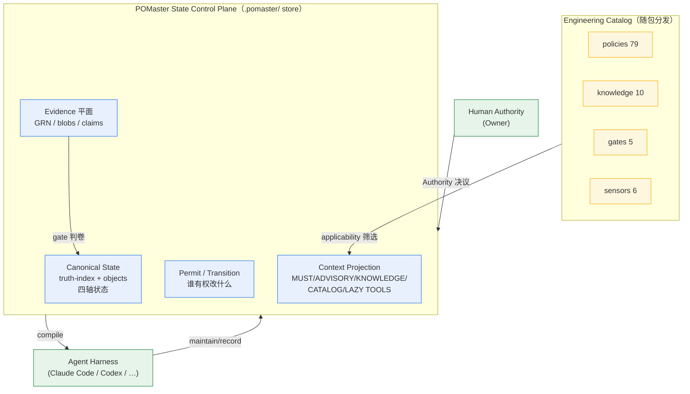
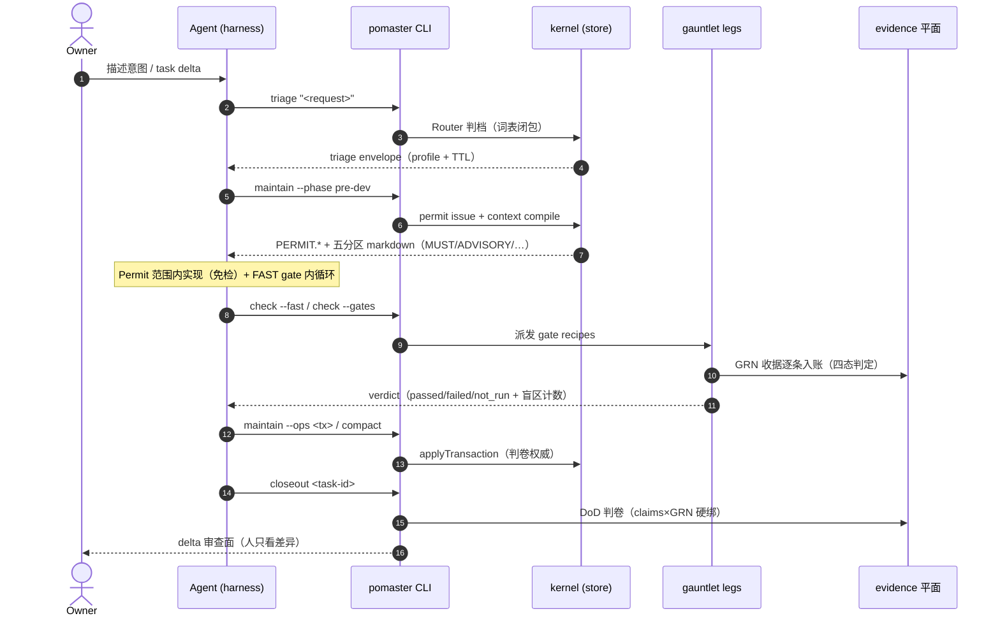
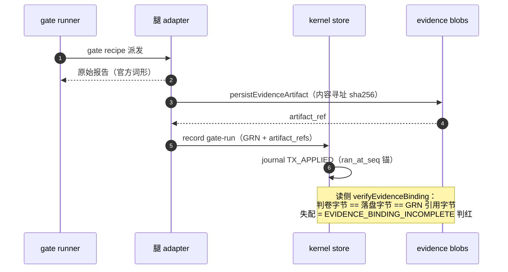
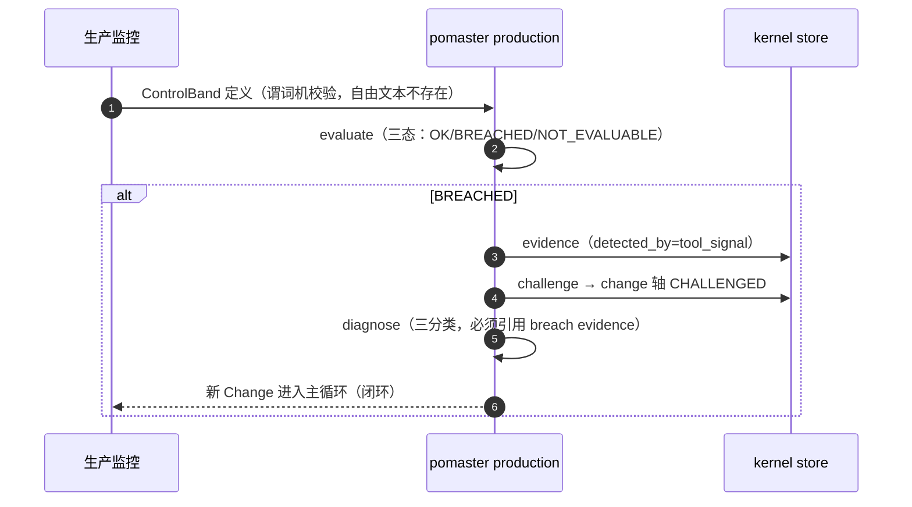
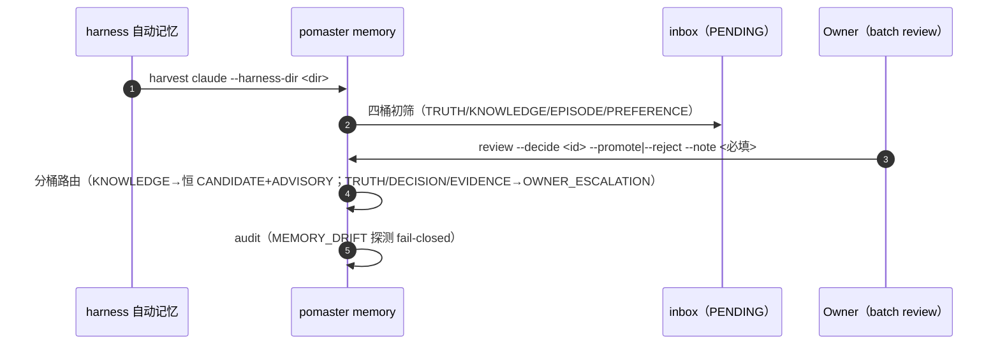
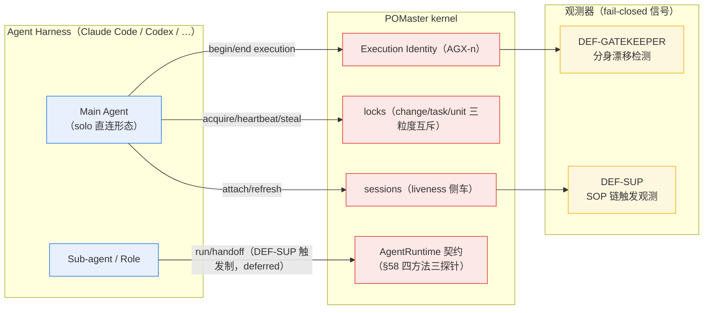

# POMaster

> **AI 软件工程的 Governed Software State Control Plane。**
> 管理系统当前可信状态、为每个 Agent 投影最小充分上下文、控制允许发生的变化、并要求一切变化被证据证明。

[](https://github.com/River-Singer/POMaster_VNext/actions/workflows/ci.yml)
[](./LICENSE)

```text
POMaster = State + Context + Transition + Evidence，在 Authority 与 Adaptive Governance 下运行
```

## 快速上手

POMaster 的全部能力收敛在一条 CLI（`pomaster`）——八拍 Change Loop 的每一拍都有对应命令面。先给一张**命令全景**（机器钉版，与 `pomaster --help` 零漂移；`#` 分节注释仅人读）。第一次使用？直接看下面 [install → init → 第一个 Change](#1-安装) 的全流程。

```text
# 0 BOOTSTRAP —— 建基线 / 速览 / 装眼睛 / 可移植性 / 自更新
pomaster init
pomaster status
pomaster doctor
pomaster portability bootstrap/check
pomaster update --check/--yes

# ① TRIAGE —— 秒级判档（MINIMAL/LIGHT/STANDARD；NO-OP 合法）
pomaster triage "<request>"

# ② FRAMEWORK —— 许可签发/判卷/显式接管/台账
pomaster permit issue/check/steal/list

# ③ PROJECTION —— 最小充分上下文投影
pomaster context compile/explain

# ④ EXECUTE —— 写路径机器执行点 / 受控变更
pomaster exec-guard --attempt <file|->
pomaster maintain <change-or-task> --ops <tx>

# ⑤ VERIFY —— FAST gate / gate recipes 派发 / 证据入账
pomaster check --fast/--gates
pomaster record gate-run/claim

# ⑥ RECONCILE —— delta 三方对账 / 投影视图 / 审计 / 例外台账
pomaster reconcile --permit <PERMIT.*>
pomaster view blueprint/task
pomaster audit blueprint/task
pomaster ledger record/list

# ⑦ COMPACT —— 折叠入账 / 知识生命周期 / 记忆收割
pomaster compact
pomaster knowledge search/inspect/record/review-candidates/promote/demote
pomaster memory capture/inspect/harvest/review/promote/audit

# ⑧ CARRY —— DoD 判卷收口
pomaster closeout <task-id>

# 横切 —— 对象检视 / Discovery / Research / Eval / Catalog / 迁移 / 生产反馈 / 多 Agent / 执行身份
pomaster inspect <governed-id>
pomaster brainstorm start/status/promote
pomaster research list/inspect
pomaster eval --suite behavioral
pomaster catalog status/explain
pomaster migrate trellis-spec --analyze --spec-root <dir>
pomaster production band/evaluate/challenge/diagnose/metrics/self-improvement
pomaster agents status
pomaster run <task>
pomaster handoff <task> --to <role>
pomaster session attach/refresh/list
pomaster lock acquire/heartbeat/release/steal/list
pomaster execution begin/end/list
pomaster trace show/list
```

### 1. 安装

```bash
# Node ≥ 22
npm install -g pomaster        # 全局安装（推荐）
# 或项目内：
npm install --save-dev pomaster
npx pomaster --help
```

### 2. 初始化治理基线：`pomaster init`

在项目根执行（幂等——重复执行第二次起 NO_CHANGE，零字节写入；已存在的人类文件一律不覆盖）：

```bash
cd your-project
pomaster init
```

它做四件事：

| 产物 | 作用 | 会被覆盖吗 |
|---|---|---|
| `.pomaster/state/truth-index.json` | Canonical State 唯一事实源（空账本起点） | 否（存在即跳过；损坏显式报错，绝不静默重建） |
| `.pomaster/state/authority.json` | Authority Map 骨架（默认登记 `BOOTSTRAP_OWNER`） | 否（人类加注的 owner 一律不动） |
| `.pomaster/config.yaml` | 治理配置（人类可编辑） | 否（只在缺失时创建） |
| `AGENTS.md` / `CLAUDE.md` | Agent 轻入口（profile + 状态速览 + 常用命令） | 仅带生成标记的（`CLAUDE.md` 通过 `@AGENTS.md` 导入共享） |

**多平台适配器**：`AGENTS.md` 恒为唯一事实源；`--platforms claude,codex,cursor,qoder` 追加各平台的细指针适配器（`CLAUDE.md` / 根 `AGENTS.md` 即 codex 原生入口 / `.cursor/rules/pomaster.mdc` / `.qoder/rules/pomaster.md`，已存在一律不覆盖）；`--platforms none` 只建 AGENTS.md + 状态骨架。TTY 交互终端直接 `pomaster init` 会出编号清单供选择；`--json` 恒走确定性缺省（claude）。

### 3. init 之后该配置什么（config.yaml）

```yaml
version: 1
profile: LIGHT            # 治理档位：MINIMAL | LIGHT | STANDARD
triage:
  ttl_hours: 168          # triage 结果有效期，过期必须 re-triage
```

**profile 三档怎么选**：

| 档位 | 适合 | 体感 |
|---|---|---|
| `MINIMAL` | 脚手架/原型/个人实验 | 几乎感觉不到 POMaster（文案改动→一行 gate） |
| `LIGHT`（默认） | 正常业务迭代 | 秒级判档 + FAST gate 内循环 + delta 审查 |
| `STANDARD` | 核心链路/多角色协作 | 全 gate 矩阵 + 浏览器双通道证据 + 抽样复核 |

**Authority（谁说了算）**：`.pomaster/state/authority.json` 默认单人形态（一切 authority 位置由项目 Owner 应答）；多人协作出现信号后再演化细粒度 owner——`owner_registry` 数组逐个登记即可，kernel 零配置变更。

### 4. 第一个 Change：走一遍八拍

```bash
pomaster triage "给用户列表页加一个导出按钮"     # ① 秒级判档
pomaster maintain <task> --phase pre-dev …       # ②③ permit 签发 + 上下文投影
# ……在你的 Agent harness（Claude Code 等）里实现代码……
pomaster check --fast                            # ⑤ FAST gate（BUILD 腿）
pomaster closeout <task-id>                      # ⑧ DoD 判卷收口
```

### 5. 装齐眼睛（可选，按需）

```bash
pomaster doctor        # 工具/MCP 探测：缺什么提示装什么
```

doctor 探针覆盖：内核 / BUILD（tsc·eslint）/ CONTRACT（oasdiff·schemathesis）/ ARCHITECTURE（depcruise·import-linter）/ COVERAGE（c8·pytest-cov）/ MUTATION（mutmut·StrykerJS）/ SECURITY（gitleaks·pip-audit·semgrep）/ BROWSER（playwright·chrome-devtools MCP）/ PERFORMANCE（lighthouse·web-vitals）/ portability。**工具缺席=显式 NOT_RUN（非绿非红），绝不假绿**。

---

## 为什么存在（三行读完的来历）

1. **旧模式治理的是文档**：把几百份 Markdown 规范播进项目、靠 Agent 自觉遵守——结果错误事实被继承放大（上个会话说"27 页开发完了"，实际半数是脚手架）、技术基线静默漂移、规范越堆越多直到没人看。
2. **血泪换来的第一定律**：*报绿的治理工具比没有工具更危险——它把「未知」转换成「已验证干净」。* 所以本项目的核心不是"更多门禁"，而是**可信的证据**。
3. **vNext 换掉治理对象**：不再治理文档，改为治理**状态本身**。文档只是状态的投影；事实必须带 Authority、Evidence 与完整生命周期。

## 运行机制：State Control Plane

POMaster 不是又一层 prompt 工程或 skill 包，而是一个**状态控制平面**——它把「软件项目当前可信的状态」作为一等公民管理起来：



三个关键设计：

- **Canonical State 是唯一事实源**：一切对象（PAGE/CAPABILITY/CHANGE/TASK…）带四轴状态（lifecycle/confidence/evidence/change）+ Authority + 完整生命周期。Markdown 文档只是它的投影。
- **Agent 不直接写状态**：一切写经 `maintain <id> --ops <tx>` 显式事务 → kernel `applyTransaction` 判卷（写路径机器执行点 `exec-guard` 判卷器非写入器）。
- **证据先于结论**：gate 运行结果走 `record gate-run` 产 GRN 收据入 evidence 平面；claim 必须显式绑定 GRN 分母——「证据缺失伪装完成」会被 closeout 硬阻断。

## SOP 编排：项目生命周期五段式

```text
0 BOOTSTRAP ──── init 扫描 / Authority Map / catalog-lock / 轻入口生成
                  （有原型→活体走查提五件套；存量项目→纳管已有 registry/spec/记忆）
1 主循环 ─────── N 次 Change，每次跑下面的八拍 Loop（项目的日常形态）
2 周期事件 ────── 全量对账 / 紧缩 / 经验入库 / catalog 升级 diff / 自托管基准
3 架构演化 ────── Challenge → ACR → 受控迁移 → Deviation 到期清算
4 生产反馈 ────── SLO 击穿 → State Challenge → 新 Change（闭环）
5 退役归档 ────── deprecation → retirement → history
```

### THE LOOP：每一次 Change 的八拍

> **Agent 的 loop 在上下文窗口内收敛，POMaster 的 loop 在 git 仓库里收敛。**
> 前者每圈归零，后者每圈复利。

```text
① TRIAGE      Router 判档（MINIMAL/LIGHT/STANDARD…）秒级分流；NO-OP 是合法成功
② FRAMEWORK   ← 人唯一主场：只锁五件套（身份/Capability/契约引用/Permit范围/验收形状）
                 条件接受即可开工，逐行签核制度已废除
③ PROJECTION  最小充分上下文投影；经验按触发条件注入 ADVISORY 区
④ EXECUTE     Permit 内实现免检；FAST gate 内循环自检；偏差走显式 Challenge
⑤ VERIFY      确定性 Gate 判卷：四态判定+盲区计数+not-applicable 清点；
               浏览器双通道证据（Playwright 断言 ∥ chrome-devtools 实时对账）
⑥ RECONCILE   所见即所得：人只审 delta（框架偏离）/例外清单/抽样点
⑦ COMPACT     Current Truth 更新或 NO_CHANGE；经验入账；任务归档
⑧ → 下一轮    携带更准的 Truth 重进①——开局一次比一次便宜
```

### 八拍时序图（Agent 交互序列）



### 证据入账时序（防假绿的核心通路）



### 生产反馈时序（SLO 击穿闭环）



### Memory Harvest 时序（COMPATIBILITY 路线）



## 类 Agent 架构

POMaster 不内置 daemon，也不托管 Agent——它给「在 harness 里跑的主 Agent」提供状态平面 + 执行身份 + 观测器：



要点：

- **Execution Identity ≠ Execution Trace ≠ Evidence**：AGX-n 是短小稳定的执行身份（runtime/model/permit 快照）；Trace 是行为侧车（writes/tool_receipts/evidence_refs，retention 四档）；Evidence 是可验证证明。三者分离（A19 美学）。
- **Gatekeeper 防分身**：同一 execution 既提 proposal 又 ALLOW → drift 观测器亮灯——「系统永不自我批准」的机器面。
- **托管编排受 DEF-SUP 触发制门槛**：solo 直连是默认形态；run/handoff 等 SOP 编排在触发条件（重复链/第二贡献者/headless-CI）出现前显式 deferred——治理开销与风险成比例（Minimum Sufficient Governance）。

## 五原语：一切能力的唯一来源

| 原语 | 回答的问题 |
|---|---|
| **Governed Object** | 系统里有什么值得长期识别的东西 |
| **State**（四轴：lifecycle/confidence/evidence/change） | 它现在处于什么状态、可信到什么程度 |
| **Context Projection** | 这个角色此刻应该看见什么 |
| **Transition / Permit** | 谁有权、凭什么条件允许它变化 |
| **Evidence** | 变化的证明由谁产出、如何防止假绿 |

Spec、Task、Gate、Knowledge、Brainstorm……全部是这五个原语的派生视图。
三个新一等公民对象族（从旧体系教训中诞生）：**分母 DENOMINATOR**（覆盖率的账本不许悄悄消失）、**键绑定 KEYBINDING**（治理 ID ↔ 代码路径的机器映射）、**producer 活性**（声明对象必须有人生产它）。

## 哲学宪法（违者即是 bug）

- Small Constitution：硬约束极少而精——不伪造事实、不越权、不静默冲突、不无证据宣称完成
- No-op is elegant：没有必要的治理动作，零变化就是成功
- Framework as Review Surface：框架约束好了的人，不需要读 AI 写的每一行代码——但前提是判卷器诚实，所以我们用对抗性用例持续攻击自己的 gate
- Minimum Sufficient Governance：治理开销必须与变更风险成比例；小改动的体验是"几乎感觉不到 POMaster"
- Memory Sovereignty：删掉本机缓存 + fresh clone + bootstrap ≈ 项目认知完全恢复

## 项目结构

```text
packages/    kernel（状态与判卷权威）· cli（命令面）· gauntlet-lite（确定性 gate 腿）· schemas（FROZEN 词表 schema）
catalog/     policies · knowledge · gates · sensors——随包分发的工程策展物料（catalog-lock 逐字节对账）
tests/       单元 / 集成 / Golden / 对抗 / 行为 / 自托管基准（数量下限进 CI 棘轮，只升不降）
benchmarks/  mutation-kill · constitutional · run-all
legal/       THIRD_PARTY_NOTICES · PROVENANCE
```

技术栈：TypeScript · Node ≥ 22 · pnpm monorepo · Canonical State 为 JSON · Git 为版本与回滚底座 · 外部测试工具一律走 Adapter（绝不进核心）。

## License

POMaster 采用**双许可**发布（Owner 决议 2026-09-01）：

- **PolyForm Noncommercial 1.0.0**（默认公共许可，仅授权非商业使用）：全文见 [`LICENSE`](./LICENSE)，官方标准文本逐字落盘；
- **Commercial**（独立商业授权）：任何商业使用（含企业内部商用、小企业商用）均不在公共许可范围内、不豁免，需另行签署书面商业授权——说明见 [`COMMERCIAL_LICENSE.md`](./COMMERCIAL_LICENSE.md)。

该组合为 source-available 双许可，不应宣传为 OSI Open Source。商标与项目标识归属见 [`TRADEMARKS.md`](./TRADEMARKS.md)；贡献授权条款见 [`CONTRIBUTING.md`](./CONTRIBUTING.md)；安全漏洞报告渠道见 [`SECURITY.md`](./SECURITY.md)；第三方依赖许可与 notice 义务见 [`legal/THIRD_PARTY_NOTICES.md`](./legal/THIRD_PARTY_NOTICES.md)。

商业授权联系：**allenxujianyang@outlook.com**

> 正式公开发布前需完成法律专业人士复核。Trellis 仅作机制研究对照，零代码继承。

## 联系方式

- **商业授权 / 合作**：[allenxujianyang@outlook.com](mailto:allenxujianyang@outlook.com)
- **问题反馈**：[GitHub Issues](https://github.com/River-Singer/POMaster_VNext/issues)
- **安全漏洞**：见 [`SECURITY.md`](./SECURITY.md)（不走公开 issue）
