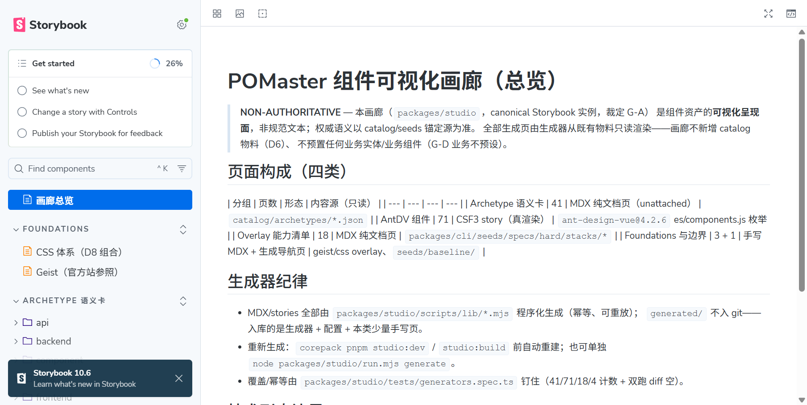
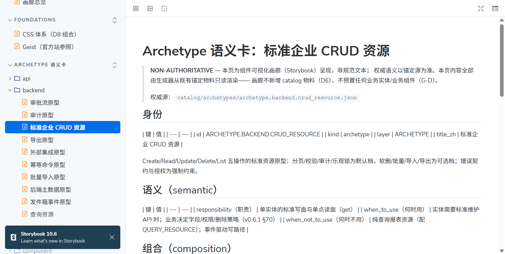
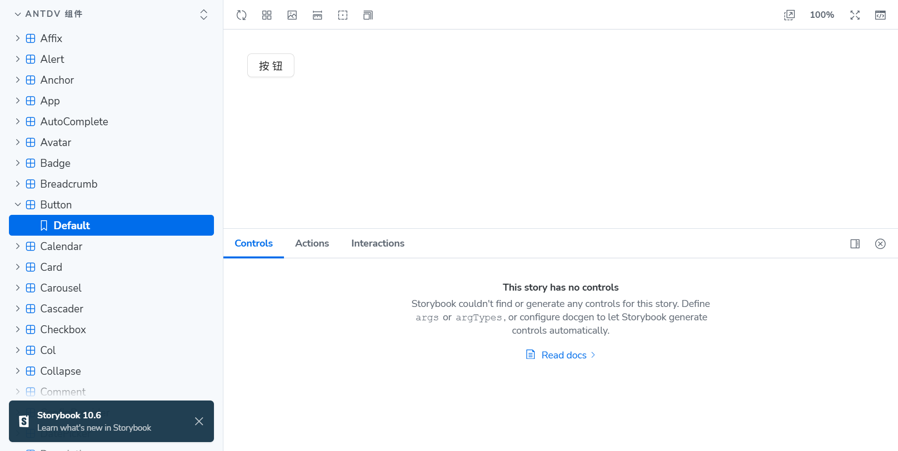
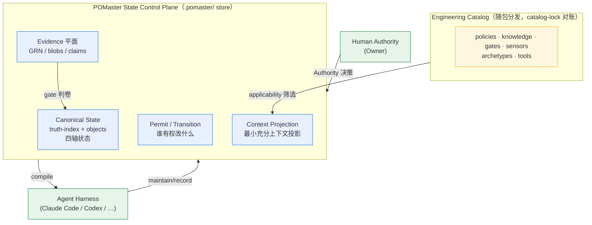

# POMaster

> **AI 软件工程的 Governed State Control Plane。**
> **Agent 写下的每一行变化，都被证据证明。**

[](https://github.com/River-Singer/POMaster_VNext/actions/workflows/ci.yml)
[](./LICENSE)

```text
POMaster = State + Context + Transition + Evidence，在 Authority 与 Adaptive Governance 下运行
```

POMaster 把「软件项目当前可信的状态」当作一等公民来管理：为每个 Agent 投影最小充分上下文、控制允许发生的变化、并要求一切变化被证据证明。它不是又一层 prompt 工程或 skill 包，而是一个**状态控制平面**。

## 为什么存在（三行读完的来历）

1. **旧模式治理的是文档**：把几百份 Markdown 规范播进项目、靠 Agent 自觉遵守——结果错误事实被继承放大（上个会话说"27 页开发完了"，实际半数是脚手架）、技术基线静默漂移、规范越堆越多直到没人看。
2. **血泪换来的第一定律**：*报绿的治理工具比没有工具更危险——它把「未知」转换成「已验证干净」。* 所以本项目的核心不是"更多门禁"，而是**可信的证据**。
3. **POMaster 换掉治理对象**：不再治理文档，改为治理**状态本身**。文档只是状态的投影；事实必须带 Authority、Evidence 与完整生命周期。

## 核心亮点

### ① 组件画廊（Storybook）：Vue 主实例 + React sidecar 可视化资产目录

「有哪些组件、长什么样、该写什么」一页可览——**41 张 archetype 语义卡**（页面/组件/后端/数据/运行时的标准件：职责、何时用、组合方式、研究锚，附「建议组件组合」逐条溯源映射）+ **71 个 ant-design-vue 组件真渲染（178 个 stories：默认形态 + disabled/loading/size/变体交互态矩阵）** + **18 页 overlay 能力清单** + foundations 边界页 + **Database Struct 占位分区**（该写什么：数据与事务主题 MUST/Checklist + baseline data 面导航——业务实体走 New Entity Gate，画廊不预置）。画廊全部由生成器从既有锚定物料**只读渲染**：不新增规范物料、不预置业务实体，页头自带 NON-AUTHORITATIVE 声明。

另有 **React sidecar**（`packages/studio-react`，`corepack pnpm studio:react:dev`，端口 6007）：`antd@5.x` 真渲染，与 antdv 同设计系统两端逐族对齐、标注「Vue 对应件」对照浏览；geist 官方包零可渲染组件（诚实说明页在座）——「React 大件」由同设计系统活跃端承担。







怎么看：

```bash
corepack pnpm studio:dev        # Vue 主实例（生成产物自动重建）
corepack pnpm studio:react:dev  # React sidecar（antd 对照浏览，端口 6007）
```

- **在线版**：[river-singer.github.io/POMaster_VNext](https://river-singer.github.io/POMaster_VNext/)（GitHub Pages，push 到 main 自动发布）
- baseline 确认后按栈参考画廊：baseline.ui 选了什么栈就对照看对应组件真渲染（如 ant-design-vue → 71 个组件 stories），41 张 archetype 语义卡与栈无关随时可查；baseline 未确认前不强制预览——画廊入口见 `pomaster init` 完成横幅。

<!-- Owner 注意（一次性）：Pages 首次启用需在仓库 Settings → Pages 把 Source 设为「GitHub Actions」，之后 studio-pages 工作流自动发布。 -->

### ② 任务驱动工作流：brainstorm → promote → 八拍

从一句话需求到证据化完成，只有一条公开通路：

- **brainstorm（Grill 拷问）**：Grounded Brainstorm 方法论——先 Ground 后 Grill、九类拷问动作、每轮只打当前 frontier；拷问产出 **Decision Graph**（不是聊天记录里的一串问题），收敛由机器判卷，火候不够就 fail-closed 列出全部缺口。
- **promote 即建任务**：讨论收敛 → `promote --apply`，TASK.*/CHANGE.* 治理对象落库——想法进状态平面的唯一入口。
- **八拍 Change Loop 机器判卷收口**：brainstorm 需求收敛（八拍①）→ permit 签发 → context 投影 → maintain 受控写 → check 判卷 → reconcile 对账 → compact 折叠 → closeout 收口。每一拍都有对应 CLI 命令、机器判卷、落账留痕。

### ③ 基线：14 键问卷 → 预置草案 → confirm 烙印 → 漂移检出

- init 的**技术栈问卷** 14 键逐项必答（前端 9 + 后端 5），答完写回 `baseline/<lane>/stack.yaml`；
- 选型落定后自动生成 **PRESET-DRAFT 预置草案**——逐条溯源到主题文档与 overlay，Owner 可改；业务实体/接口/数据模型零预置；
- `pomaster baseline confirm` 以 **sha256 快照烙印**基线——快照分母 = 25 文件确认资产清单（2 stack.yaml + 22 份基线 md + design-tokens.yaml）；确认前提是**阻塞集清零**（未销账且未豁免的键才阻塞——Owner 可在 manifest unknowns 台账登记豁免行，登记行不阻塞；doctor/status 呈现阻塞余量）；
- closeout 双重阻断：未确认 → `BASELINE_NOT_CONFIRMED`；确认后改动 → `BASELINE_DRIFT`（检出谁改了架构）。漂移的消解必须显式留痕——重确认三通道：`--change <CHANGE-id>` 治理通路 / `--ack-drifted --note "<理由>"` Owner 手改声明（AI 代跑须持 Owner 指示）/ 裸重确认显式拒绝。

### ④ 证据链：一切结论带收据

gate 运行结果走 `record gate-run` 产 **GRN 回执**入 evidence 平面；claim 必须显式绑定 GRN 分母；`record verification` 把 claim 推到 VERIFIED；closeout 判卷「claims × GRN 硬绑」——证据缺失伪装完成会被**阻断码**硬拦。读侧字节级核验：判卷字节 == 落盘字节 == GRN 引用字节，失配即判红。

## 快速上手

POMaster 的全部能力收敛在一条 CLI（`pomaster`）——八拍 Change Loop 的每一拍都有对应命令面。先上**命令全景**（与 `pomaster --help` 对账零漂移；`#` 分节注释仅人读）。第一次使用？直接看 [安装 → init → 第一个 Change](#1-安装) 的全流程。

```text
# 0 BOOTSTRAP —— 建基线 / 速览 / 可行动项 / 装眼睛 / 可移植性 / 自更新
pomaster init
pomaster status
pomaster alerts
pomaster doctor
pomaster portability bootstrap/check
pomaster update --check/--yes
pomaster baseline set/confirm   # set = 单键销账（确认态在座改型须持 --change——写入转 pending-change 批，同 ref confirm 终结）；confirm = 基线确认 gate（前提 = 阻塞集清零：未销账且未豁免的键，manifest 豁免登记行不阻塞；快照 = 25 文件确认资产清单 sha256；重确认三通道 --change / --ack-drifted --note / 裸重确认拒绝；doctor/status 呈现确认态与阻塞余量——closeout 阻断码的消费源）

# ① DISCOVERY —— 需求拷问/问题闸/决议图（Brainstorm/Question Gate）
pomaster brainstorm start/question-gate/status/decide/promote

# ② FRAMEWORK —— 许可签发/判卷/显式接管/台账
pomaster permit issue/check/steal/list

# ③ PROJECTION —— 最小充分上下文投影（消费 confirmed baseline/tokens：确认态三态 + 25 资产 digest 摘要 +
# design-tokens 九组三态进 AUTHORITATIVE/ADVISORY 分区；baseline 漂移/改型 → --check STALE_GROUNDING 呈现）
pomaster context compile/explain

# ④ EXECUTE —— 写路径机器执行点 / 受控变更
pomaster exec-guard --attempt <file|->
pomaster maintain <change-or-task> --ops <tx>

# ⑤ VERIFY —— Verification Plan 编译 / FAST gate / gate recipes 派发 / 证据入账
pomaster plan compile        # 证据计划编译（W1-R1-3）：--task（payload.acceptance 纯读）或 --input 契约直传（互斥）→ 逐验收义务计划（applicability 三值各带依据；缺工具≠N/A 保持 REQUIRED+tool_gap；无法判断保留 unknown 禁默认 N/A；informational 档位零参与——A1 裁定；变更面 --face "kind=present|absent:<依据>" 显式申报禁猜测；词形=SP 提案待追认）
pomaster tools list/validate # ToolBinding 统一注册面六分态（W1-R1-4；SP 提案待追认）：.pomaster/tools/bindings.json 在座即唯一工具事实源（detect/registered/validated/available/selected/executed 分态不可跃迁、缺口逐条显式；--plan 回喂计划工件对账 selected；executed 唯一事实源=GRN 真实回执——工具发现≠调用授权；registry 缺席时 plan compile 回退 legacy 探测）
pomaster check --fast/--gates
pomaster record gate-run/claim/verification

# ⑥ RECONCILE —— delta 三方对账 / 投影视图 / 审计 / 例外台账
pomaster reconcile --permit <PERMIT.*>
pomaster view blueprint/task/attention/decision
pomaster audit blueprint/task/test-weakening
pomaster ledger record/list

# ⑦ COMPACT —— 折叠入账 / 知识生命周期 / 记忆收割
pomaster compact
pomaster knowledge search/inspect/record/review-candidates/promote/demote
pomaster memory capture/inspect/harvest/review/promote/audit
pomaster negative-history record/search   # 任务内已否定方案（W1-R1-7；REQ-03/AC-02）：record 绑定 TASK.*（--approach/--reason 必填 + --evidence-ref 可选，数据住 task payload.negative_history——不建第二库）；search 词级精确检索、未命中显式「无记录」；context compile 经 [ADVISORY KNOWLEDGE] 分区可见（重编译/rollover 仍可检索，不进 gate 判卷输入）

# ⑧ CARRY —— DoD 判卷收口
pomaster closeout <task-id>

# 横切 —— 对象检视 / 图视图 / Discovery / Research / Eval / Catalog / 迁移 / 生产反馈 / 多 Agent / 执行身份
pomaster resolve "<need>" [--hints ...]
pomaster new-entity check <governed-id> [--need ...]
pomaster inspect <governed-id>
pomaster graph <governed-id> [--view impact]
pomaster recon import-graph|migrations|sbom|architecture-snapshot|token-sources|scripts|openapi    # 宿主代码 recon（七子命令均必持 --execution-id <AGX-n>——execution begin 登记的执行身份锚，观察回执的身份证明）：import 图静态扫描（unmapped 清单/externalImports/confidence → OBS 回执）/ migration 目录五栈词形盘点（prisma/flyway/liquibase/alembic/django_style 纯读盘零工具执行 → ENVREC 回执）/ SBOM 依赖清单采集（cdxgen 腿——工具缺席 NOT_INSTALLED、解析失败 INCONCLUSIVE 兜底）/ 架构快照（dependency-cruiser 巡报告落盘 + 官方 --baseline 存量底账增量 diff 三态 new/same/resolved；依赖边只计数零落盘提案）/ token 源词形枚举（DTCG/style-dictionary $value JSON + Tailwind v4 @theme/:root CSS 词法扫描 → readDesignTokens 权威面状态复用呈现；零值摘录零写口）/ package.json scripts 词面枚举（只枚举不执行 → ENVREC 回执）/ OpenAPI 运行时抓取（--url 探活 GET 落 blob——探活失败 NOT_INSTALLED 不降级；静态抽取保持 UNKNOWN）——全链 fail-closed（缺席 NOT_INSTALLED/NOT_RUN、解析失败 INCONCLUSIVE 负值兜底不伪造绿），产物只落 evidence sidecar 平面零权威写口
pomaster research list/inspect/request/handoff
pomaster eval --suite behavioral
pomaster catalog status/explain/relock
pomaster migrate trellis-spec --analyze --spec-root <dir>
pomaster production band/evaluate/challenge/diagnose/metrics/self-improvement
pomaster agents status/dispatch-pack
pomaster run <task>
pomaster handoff <task> --to <role>
pomaster session attach/refresh/list
pomaster lock acquire/heartbeat/release/steal/list
pomaster execution begin/end/list/audit   # audit = 变更越界审计（--execution-id + --diff-base：git diff 起始锚变更集 → KEYBINDING 解析 → permit scope 判 in/out → OBS 回执 sidecar + 越界明细；越界 exit 1——Detection 半边，纯读零权威写口）
pomaster trace show/list
# pomaster session（不带子命令）= 治理速览投影（SessionStart 注入源；≤10k 字符，恒 exit 0；尾部带首答确认协议指令段）
# pomaster alerts（重入口 UserPromptSubmit 源）= 可行动项过滤器 + workflow 路由段（干净=非空但极简，恒 exit 0）
```

### 1. 安装

```bash
# Node ≥ 22
npm install -g pomaster        # 全局安装（推荐）
# 或项目内：
npm install --save-dev pomaster
npx pomaster --help
```

### 2. 初始化：`pomaster init`

```bash
cd your-project
pomaster init
```

一条命令，幂等（重复执行 NO_CHANGE，人类文件一律不覆盖）：铺出 `.pomaster/` 治理目录树、登记 19 份 SPEC 预植对象、生成 `AGENTS.md` 重入口（14 份 skills 命令卡 + hooks 注入——Agent 开会话即自动看到治理状态）。init 还会**自动观察宿主 `package.json`**：框架/router/状态/Grid/UI 库/测试栈等可观察事实登记为**观察候选**（问卷题面标注 `[Observed: package.json]`）——候选只是题面参考注记，权威 stack.yaml 保持 UNKNOWN，直到 Owner 经问卷或 `pomaster baseline set` 逐键采纳；TTY 下技术栈问卷 14 键逐项必答（中断 = 零写入）。

**接手已有项目？init 自带 Brownfield 路径**：init 启动时检测宿主形态——干净目录（Greenfield）静默直入、已初始化重入口行为不变；检测到**已有项目**（worktree 非空且无 `.pomaster`）时呈现检测摘要（源文件数 / migration 词形面 / SBOM 工具在位性），并在 TTY 问卷首题**显式确认**是否走 Brownfield 路径（禁静默分叉；非交互通道不分支）。确认后 init 自动运行 **recon 三腿**采集宿主事实——`import-graph`（import 图静态扫描）/ `migrations`（五栈词形盘点）/ `sbom`（依赖清单，cdxgen 缺席时显式跳过）——产物落 `.pomaster/evidence/` 观察回执 sidecar（零权威写口；腿失败不阻塞 init），并在完成输出与问卷候选**合并呈现差距报告**：Owner 就地裁剪后照常走 `pomaster baseline confirm` 确认链。

**组件画廊**：[river-singer.github.io/POMaster_VNext](https://river-singer.github.io/POMaster_VNext/)（在线版）· POMaster 仓库内 `corepack pnpm studio:dev`（Vue 主实例）/ `corepack pnpm studio:react:dev`（React sidecar 对照）——baseline 确认后按栈选择性参考（如 baseline.ui=ant-design-vue → antdv 组件真渲染对照）；未确认前仅作了解，不作为动手前置。

> 产物全表 / 目录宪法 / 播种语义 / 重入口细节 / 问卷与 confirm 机制 / doctor 探针矩阵：详见 [docs/init-reference.md](docs/init-reference.md)。

### 3. init 之后该配置什么（config.yaml）

```yaml
version: 1
capability_tips: true     # status 尾部轮换能力 tip（呈现位偏好；false 关闭 = 零输出）
store:
  state: .pomaster/state/truth-index.json
  objects: .pomaster/truth/objects/
```

> 治理强度不靠档位开关：每一拍的判卷由 gate/permit/closeout 等机器判卷面确定性承担，
> 不存在 MINIMAL/LIGHT/STANDARD 档位分级（历史档位语义已按 Owner 裁定 D-1 彻底退役，
> 2026-09-08——目录/能力的激活判据是「治理能力相关性」，见 `.pomaster/layout.json`
> 各目录 activation_hint）。

Authority（谁说了算）：`.pomaster/state/authority.json` 默认单人形态（一切 authority 位置由项目 Owner 应答）；多人协作出现信号后再演化细粒度 owner——`owner_registry` 数组逐个登记即可。

### 4. 第一个 Change：走一遍最小真实路径

```bash
# —— Discovery：把「想法」收敛成有判卷的合同（无需先建任务） ——
pomaster brainstorm start --id idea-export-btn --prompt "给用户列表页加一个导出按钮"
pomaster brainstorm decide idea-export-btn --set candidates.json --retrieved CURRENT_TRUTH --retrieved REPO
pomaster brainstorm decide idea-export-btn --answer DECISION.EXPORT_SCOPE --accept
pomaster brainstorm decide idea-export-btn --ready \
  --goal "用户列表页导出按钮——投影进 TASK intent" \
  --scope "用户列表页导出（PAGE.USER_LIST）" \
  --acceptance "导出按钮点击后触发 CSV 下载且构建计数可独立重算@DECISION.EXPORT_SCOPE"

# —— 提升：promote 即建任务（自动 record claim 生成 CLM 绑入 acceptance） ——
pomaster brainstorm promote idea-export-btn --to TASK --basis msd_reached --apply

# —— 八拍推进：next-action 会逐拍给唯一建议命令 ——
pomaster status                                   # R_PERMIT_MISSING（--subject 为 affected_objects 派生建议）
pomaster permit issue --subject PAGE.USER_LIST --actor human:owner --change-ref TASK.IDEA_EXPORT_BTN
pomaster baseline confirm                         # R_BASELINE_NOT_READY（阻塞集清零后的一次性收口账；确认态随后进 ③ 投影）
pomaster context compile --role frontend --change TASK.IDEA_EXPORT_BTN   # ③ 投影（含 baseline grounding：指纹绑定确认态，漂移即 STALE_GROUNDING）
pomaster execution begin --role implementer --runtime script --identity-kind script --task-id TASK.IDEA_EXPORT_BTN  # ④ 执行身份
# ……在你的 Agent harness（Claude Code 等）里实现代码……
pomaster check --fast                             # ⑤ FAST gate（BUILD 腿）
pomaster closeout TASK.IDEA_EXPORT_BTN            # ⑧ DoD 判卷收口（对的是 promote 时刻的 acceptance）
```

关键语义：`--ready` 的 goal/scope/acceptance 文本申报是 Task Contract——promote 编译投影进
TASK 对象（intent/acceptance 挂锚/affected_objects/notesMd），验收条目自动挂 CLM，closeout
判卷对得上最初 Expected State；中途任何一步不知道下一步做什么，问 `pomaster status`（或看
alerts breadcrumb），路由表会给出唯一建议命令。

### 5. 装齐眼睛（可选，按需）

```bash
pomaster doctor        # 工具/MCP 探测：缺什么提示装什么
```

工具缺席 = 显式 NOT_RUN（非绿非红），绝不假绿。浏览器双眼分工：`chrome-devtools` MCP 是观测诊断面（页面慢/报错/卡住必须实测真实浏览器），`playwright` MCP 是确定性 E2E 验证面——两边产物都进证据链。

## 运行机制：State Control Plane



关键设计：

- **Canonical State 是唯一事实源**：一切对象（PAGE/CAPABILITY/CHANGE/TASK…）带四轴状态（lifecycle/confidence/evidence/change）+ Authority + 完整生命周期。Markdown 文档只是它的投影。
- **Agent 不直接写状态**：一切写经 `maintain <id> --ops <tx>` 显式事务 → kernel 判卷（写路径机器执行点 `exec-guard` 是判卷器非写入器）。
- **证据先于结论**：gate 运行结果走 `record gate-run` 产 GRN 收据入 evidence 平面；claim 必须显式绑定 GRN 分母——「证据缺失伪装完成」会被 closeout 硬阻断。
- **先画靶子，再射箭**：随包分发 41 份 archetype 标准件（语义全部锚定官方文档实抓）——`pomaster resolve` 先在标准件与已有对象里选/配/组，真没有才设计新的，且新建必过 New Entity Gate；`pomaster graph` 把对象图（采纳边/依赖/影响闭包）变成人看得见的投影。
- **Gatekeeper 防分身**：同一执行既提 proposal 又放行 → 漂移观测器亮灯——「系统永不自我批准」的机器面。

### THE LOOP：每一次 Change 的八拍

> **Agent 的 loop 在上下文窗口内收敛，POMaster 的 loop 在 git 仓库里收敛。**
> 前者每圈归零，后者每圈复利。

```text
① DISCOVERY   Brainstorm/Question Gate 需求收敛：Decision Graph 判卷推进；promote 即建任务
② FRAMEWORK   ← 人唯一主场：只锁五件套（身份/Capability/契约引用/Permit范围/验收形状）
                 条件接受即可开工，逐行签核制度已废除
③ PROJECTION  最小充分上下文投影；经验按触发条件注入 ADVISORY 区
④ EXECUTE     Permit 内实现免检；FAST gate 内循环自检；偏差走显式 Challenge
⑤ VERIFY      确定性 Gate 判卷：四态判定+盲区计数+not-applicable 清点；
               浏览器双通道证据（Playwright 断言 ∥ chrome-devtools 实时对账）
⑥ RECONCILE   所见即所得：人只审 delta（框架偏离）/例外清单/抽样点
⑦ COMPACT     Current Truth 更新或 NO_CHANGE；经验入账；任务归档
⑧ → 下一轮    携带更准的 Truth 重进①——开局一次比一次便宜
```

## 实战：一个需求的完整旅程

> 以下案例来自一个真实的企业级业务系统前端项目（下称「项目 M」），已脱敏；摄于 POMaster 前代工作流，按现行八拍通路重排叙述——个别拍以近邻机制代证，逐处标注【示意】/【近似】。真实感优先于宣传感，这也是本项目对「证据」二字的基本态度。

**需求**：「把原型里的条目清单计算页照搬落地——33 列可编辑大表 + 2 个公式列 + 保存/快照/回滚等 9 类操作」。同一模块后来长出第二章：把 58 条业务公式（需求简报误记 42 条，拷问阶段实测纠正）从「散写各实体、部分零实现」改为「数据驱动注册进独立公式引擎，业务页只调引擎 API」。

**拷问（brainstorm → promote，八拍①）**：不接受需求转述——先提取原型线框，再拷问出 5 个决策点（组件逐个配对、API 缺口清单抛给 Owner 二选一……），收敛为 Decision Graph 后 `promote --apply` 建任务。最有立场的一条：「列配置要不要持久化」被协议的六项强制要求拦成「先不做，仅会话内记忆，并给出未来纯增量路径」——治理机制替需求做减法。（沿革注：案例摄于前代工作流，当年的「判档（triage）示意拍」已随 D-1/D-5 档位语义退役删除——2026-09-08，owner-adjudications.md#裁决18；需求收敛一律走八拍① Brainstorm 单入口。）

**许可与投影（permit → context）**【近似拍：前代以 planner gate + 协议绑定代行 permit】：开工前，「这个任务允许碰哪些协议面」已被机器记录为 12 项 gate 全通过 + 11 条协议绑定；`pomaster context compile` 向 implement 与 check 两侧注入同一组规格（各 20 条），每条带字节级哈希锚定——写的人与验的人拿同一份事实。第二章拆出的 4 个子任务，投影条目连上游 research 文件都带理由逐条注入：调研不靠会话记忆传导，靠文件传导。

**实现与判卷（maintain → check）**：代码在许可范围内受控写入；`pomaster check` 判了 **FAIL——尽管 9 条验收标准全部通过**（交付物缺四态渲染）。证据链不允许「单测绿」冒充「已验证」，三种假绿各被不同的对账机制钉出：

- **测试空转断言**（本案例）：测试在跑，失败路径上却零断言——引擎全挂时照样报绿。判卷问的不只是「绿不绿」，还有「绿得有没有内容」，修复清单点名补无条件断言。
- **查询失败伪装空态**（同项目另一次审计驱动的三页治理修复）：try-catch 吞错返回空列表，把「查询失败」演成「没有数据」——两者在界面上长一样，在蓝图↔实现↔原型↔协议四方对账、逐处 file:line 取证里不一样：失败必须走可恢复渲染态。
- **mock 同引用致数据不刷新**（同次修复）：mock 返回与缓存同引用，框架结构共享把「新数据」判成「没变化」——测试绿、界面旧数据。check 追加复验现形，修复为深拷贝快照；验收全是实测数字：权限弹窗切角色 82 框 26 勾 → 61 框 21 勾、脏勾选零泄漏。

**修复与回写（reconcile → compact）**：判卷产出不是「过/不过」一个字，而是六项修复、两项有理由的拒绝修复、九处文档漂移回写。三个细节最见性格：复验抓出「修复自身引入的回归」——派生列改返回字符串后，大表数值排序退化成字典序（`'1234.56'` 排到 `'888.88'` 前面）；性能实测 4.17ms 远低于帧预算，明确拒绝加缓存；事实源自打脸——事实源里写着指南明令禁止的运算符优先级，回写改正并附理由。

**收口（closeout）**：现行 `pomaster closeout` 判卷 claims × GRN 硬绑定，证据不齐即 BLOCKED。本案例的收口留痕：任务状态机走完归档；同批会话实录——单日 45 commits、四门禁 + 273 测试全绿、11 个任务归档。

**换任何项目，这条通路不变——变化的是被治理的内容，不变的是「每一行变化都被证据证明」。**

## 五原语：一切能力的唯一来源

| 原语 | 回答的问题 |
|---|---|
| **Governed Object** | 系统里有什么值得长期识别的东西 |
| **State**（四轴：lifecycle/confidence/evidence/change） | 它现在处于什么状态、可信到什么程度 |
| **Context Projection** | 这个角色此刻应该看见什么 |
| **Transition / Permit** | 谁有权、凭什么条件允许它变化 |
| **Evidence** | 变化的证明由谁产出、如何防止假绿 |

Spec、Task、Gate、Knowledge、Brainstorm……全部是这五个原语的派生视图。
三个新一等公民对象族（从旧体系教训中诞生）：**分母 DENOMINATOR**（覆盖率的账本不许悄悄消失）、**键绑定 KEYBINDING**（治理 ID ↔ 代码路径的机器映射）、**producer 活性**（声明对象必须有人生产它）。

## 哲学宪法（违者即是 bug）

- Small Constitution：硬约束极少而精——不伪造事实、不越权、不静默冲突、不无证据宣称完成
- Heavy Entry by Default：入口即治理——init 默认安装 skills 命令卡库 + hooks 注入，Agent 开会话即见状态；hook 注入内容永远是 Canonical State 的投影，不是第二事实源
- No-op is elegant：没有必要的治理动作，零变化就是成功
- Framework as Review Surface：框架约束好了的人，不需要读 AI 写的每一行代码——但前提是判卷器诚实，所以我们用对抗性用例持续攻击自己的 gate（8 个宪法回归 Case 组成永久套件，守护「一句话需求必须过 grounding、原型实现无权威、agent 不得自批、观察失败≠不存在、截图≠payload」等核心不变式）
- Minimum Sufficient Governance：治理开销必须与变更风险成比例；小改动的体验是"几乎感觉不到 POMaster"
- Memory Sovereignty：删掉本机缓存 + fresh clone + bootstrap ≈ 项目认知完全恢复

## 自举（Self-Hosting）：本仓被自家治理

POMaster 的开发仓自己吃自己的治理：仓库根本机台账 `.pomaster/`（入 `.gitignore`，治理态不入库）由 `createStore` 骨架语义重建——`loadStoreReadOnly` 与 doctor 五探针全绿（2026-09-11 自举审计 F1「vocab 指纹过期空骨架」由此根治：重建后 `vocab_lock.prefixes` 恒等于当前词表镜像）。本工作区（仓库上层宿主目录）的 Claude Code 已注册 **PreToolUse 写前拦截 hook**：`Edit|Write|NotebookEdit|Bash` 工具调用先经 `hooks/exec-guard-hook.py`（判卷逻辑单一源，git 跟踪；运行时面 `.claude/hooks/` 内为同名词形转发 shim）解析目标路径 → KEYBINDING 映射 governed id → 调 `pomaster exec-guard` 对照活跃 execution 的 permit scope 判卷：

| 判定 | 行为 | 条件 |
|---|---|---|
| (a) 透传放行 | exit 0 + stderr 一行注记 | store 未初始化 / 无活跃 execution / 目标无 KEYBINDING 绑定（unmapped）/ Bash 命令无路径词形——条件激活语义，非治理态日常操作不堵 |
| ALLOW | exit 0 + stderr 注记 | 活跃 execution 的任一 permit scope.subject_ids 覆盖映射 id（多 permit 并集，`kernel checkPermit` 唯一判卷权威） |
| (b) DENY | exit 2 阻断 + stderr 指路正确 permit 面 | 映射 id ∉ scope（PERMIT_SCOPE_DENIED）/ execution 显式无 permit / permit 引用不存在（PERMIT_UNKNOWN） |
| (c) fail-open | exit 0 + stderr 显式声明 | 判卷器自身故障（CLI 入口缺席 / 进程故障 / 台账损坏）——防 hook 卡死开发流，审计线索由 Detection 半边 `pomaster execution audit`（①号切片）兜底复查 |

如实边界：Bash matcher 只做路径词形粗筛不做 shell 语义分析（op 恒按写语义 `upsert_object` 判卷，读命令提及 mapped 路径会误报 DENY）；「不 begin execution 就没有判卷」是条件激活语义的既定开口（未审计会话由 execution audit 呈报）；permit 仍走 Owner 既有通路，hook 不签发。三态各有确定性测试（`packages/cli/tests/exec-guard-hook.spec.ts`，端到端真跑 `exec-guard`）。

## 深入阅读

- [`docs/init-reference.md`](docs/init-reference.md) — `pomaster init` 全机制：产物表 / 目录宪法全树 / 播种语义 / 重入口三件套 / 模式分叉（Greenfield / Brownfield recon 编排）/ 技术栈问卷 / 基线确认 gate / 预置草案 / doctor 探针矩阵
- [`docs/kernel-api.md`](docs/kernel-api.md) — kernel API 参考
- [组件画廊（在线版）](https://river-singer.github.io/POMaster_VNext/) — GitHub Pages；仓库源在 [`packages/studio`](packages/studio/)（Vue 主实例）与 [`packages/studio-react`](packages/studio-react/)（React sidecar，private 对照实例）
- [`catalog/`](catalog/) — 随包分发的工程策展物料（policies / knowledge / gates / sensors / archetypes / tools）
- [`references/`](references/) — concept-ledger（治理概念账本）· external-sites-index（外部参照站点索引）

## 项目结构

```text
packages/    kernel（状态与判卷权威）· cli（命令面）· gauntlet-lite（确定性 gate 腿）· schemas（FROZEN 词表 schema）· studio（组件画廊 Storybook 实例——private，不入 npm 发布面）
catalog/     policies · knowledge · gates · sensors · archetypes · tools——随包分发的工程策展物料（catalog-lock 逐字节对账；手补物料后 `pomaster catalog relock` 一键重锁）
references/  concept-ledger（治理概念账本）· external-sites-index（外部参照站点索引）
tests/       单元 / 集成 / Golden / 对抗 / 行为 / 自托管基准（数量下限进 CI 棘轮，只升不降）
benchmarks/  mutation-kill · constitutional · run-all
legal/       THIRD_PARTY_NOTICES · PROVENANCE
```

技术栈：TypeScript · Node ≥ 22 · pnpm monorepo · Canonical State 为 JSON · Git 为版本与回滚底座 · 外部测试工具一律走 Adapter（绝不进核心）。

## License

POMaster 采用**双许可**发布：

- **PolyForm Noncommercial 1.0.0**（默认公共许可，仅授权非商业使用）：全文见 [`LICENSE`](./LICENSE)，官方标准文本逐字落盘；
- **Commercial**（独立商业授权）：任何商业使用（含企业内部商用、小企业商用）均不在公共许可范围内、不豁免，需另行签署书面商业授权——说明见 [`COMMERCIAL_LICENSE.md`](./COMMERCIAL_LICENSE.md)。

该组合为 source-available 双许可，不应宣传为 OSI Open Source。商标与项目标识归属见 [`TRADEMARKS.md`](./TRADEMARKS.md)；贡献授权条款见 [`CONTRIBUTING.md`](./CONTRIBUTING.md)；安全漏洞报告渠道见 [`SECURITY.md`](./SECURITY.md)；第三方依赖许可与 notice 义务见 [`legal/THIRD_PARTY_NOTICES.md`](./legal/THIRD_PARTY_NOTICES.md)。

商业授权联系：**allenxujianyang@outlook.com**

> 正式公开发布前需完成法律专业人士复核。Trellis 仅作机制研究对照，零代码继承。

## 联系方式

- **商业授权 / 合作**：[allenxujianyang@outlook.com](mailto:allenxujianyang@outlook.com)
- **问题反馈**：[GitHub Issues](https://github.com/River-Singer/POMaster_VNext/issues)
- **安全漏洞**：见 [`SECURITY.md`](./SECURITY.md)（不走公开 issue）
